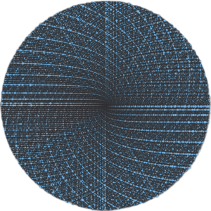
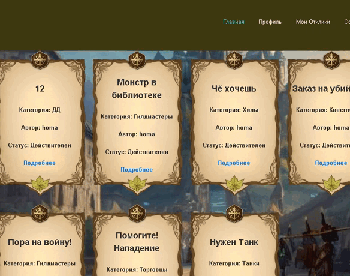
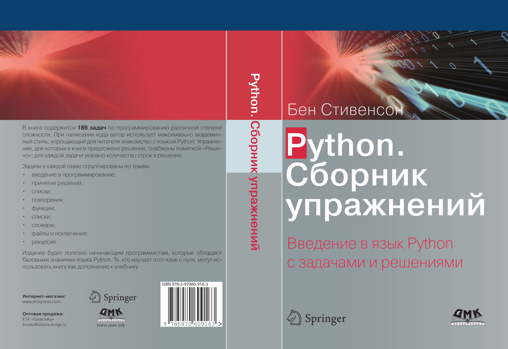

## Привет, я Максим 👋

  <h2>Welcome to My GitHub Profile!</h2>
  
Ознакомьтесь с моей статистикой на GitHub ниже:

  
   
  
   

## Обо мне

Я начинающий разработчик на Python с большим интересом к не только веб-разработке, но и в целом программированию. Вдохновляюсь возможностями, которые может предоставить программирование, и стремлюсь постоянно улучшать свои навыки.

- 🌱 В данный момент изучаю: **фреймворк Django, автоматизацию задач с помощью Python, написание БД с помощью SQLite и PostgreSQL**
- 📫 Как связаться со мной:  
- ⚡️ Увлечения: Программирование, чтение, сёги (японские шахматы) и обычные шахматы.

## Навыки и инструменты 

## Мои Проекты

### [BulletinBoard](https://github.com/Tasank/MMORPG_Site)

BulletinBoard - это интернет-ресурс для фанатского сервера MMORPG, который позволяет пользователям создавать и редактировать объявления, отправлять отклики на объявления других пользователей и получать уведомления о новых откликах. Проект реализует функционал доски объявлений, где пользователи могут делиться информацией о своих услугах или товарах.

#### Маленькая демонстрация проекта:

### [solutions-186-bens-stevenson-rus](https://github.com/Tasank/solutions-186-bens-stevenson-rus)

Решения 186 задач из книги Бена Стивенсона на языке Python. Все задачи переведены и решены на русском языке.

#### С остальными проектами можно ознакомится в репозитории

## Контакты

- Email: 
- Telegram: 
- GitHub: [Tasank](https://github.com/Tasank)

Спасибо, что заглянули! Надеюсь, вам понравятся мои проекты и вы найдете что-то интересное для себя.

